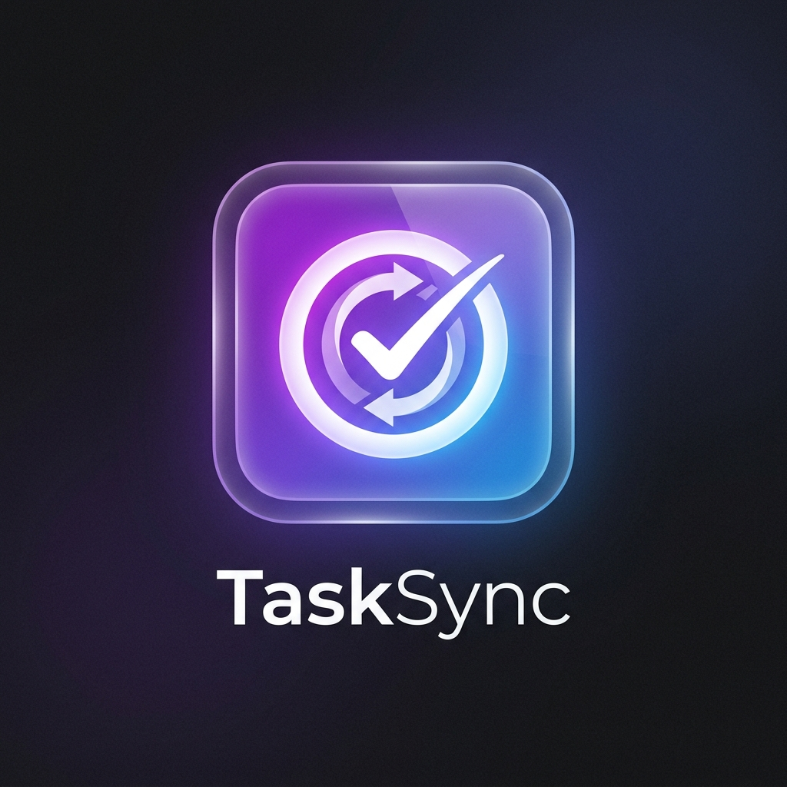

# ⏰ TaskSync - The Smart Schedule Reminder

<p align="center">
  
</p>

<p align="center">
  
  
  
  
  
</p>

<p align="center">
  <strong>TaskSync</strong> is a beautiful, highly polished schedule reminder app built in Flutter. It features smart time & date parsing, seamless local storage to persist your daily tasks permanently, and custom email integrations using Google Apps Script to remind you exactly when you need it.
</p>

---

## ✨ Features

| Feature | Description |
|---|---|
| 🎨 **Perfect UI & Animations** | Glassmorphic design, smooth splash screens, and engaging custom checklist interactions. |
| 🧠 **Smart Input Formatting** | Type `3` and it instantly formats to `03:00`. Dates format automatically as you type (`MM/DD/YYYY` or `-`). |
| 💾 **Persistent Local Storage** | Uses SQLite to save all your tasks securely on your device until you uninstall the app. |
| 📧 **Custom Email Reminders** | Integrates with Google Apps Script to trigger precise email notifications at your chosen time. |
| 🔔 **Morning Briefings** | Local push notifications to wake you up with your full day's agenda. |
| 🌙 **Light & Dark Mode** | A sleek, borderless UI that looks phenomenal in any theme. |

---

## 📥 How to Download & Run (For Users)

1. Go to the [Releases](https://github.com/HelloWorld-Farhan/Reminder-Flutter-APP/releases) section of this repository.
2. Download the latest **`app-release.apk`** file.
3. Install it on your Android device.
4. Open **TaskSync**, add your daily schedule, and let it handle your reminders!

---

## 💻 How to Build (For Developers)

Before you begin, ensure you have the **Flutter SDK** installed on your system.

### Step 1 — Clone the Repository
```bash
git clone https://github.com/HelloWorld-Farhan/Reminder-Flutter-APP.git
cd Reminder-Flutter-APP
```

### Step 2 — Fetch Dependencies
```bash
flutter pub get
```

### Step 3 — Run Locally
```bash
flutter run
```

### Step 4 — Build the APK Release
```bash
flutter build apk --release
```
*Your `app-release.apk` file will be generated inside `build/app/outputs/flutter-apk/`.*

---

## 👨‍💻 Author

**Farhan Khalid**  
📧 farhankhalid17968@gmail.com  
🔗 [LinkedIn](https://www.linkedin.com/in/farhan-khalid-117514259/)  
🐙 [GitHub](https://github.com/HelloWorld-Farhan)  

---

## 📄 License

```text
MIT License

Copyright (c) 2026 Farhan Khalid

Permission is hereby granted, free of charge, to any person obtaining a copy
of this software and associated documentation files (the "Software"), to deal
in the Software without restriction, including without limitation the rights
to use, copy, modify, merge, publish, distribute, sublicense, and/or sell
copies of the Software, and to permit persons to whom the Software is furnished
to do so, subject to the following conditions:

The above copyright notice and this permission notice shall be included in all
copies or substantial portions of the Software.
```

---

## 🌟 Support

If you found this app helpful for managing your schedule, please consider giving it a ⭐ on GitHub!

<p align="center">Made with ❤️ in India</p>
